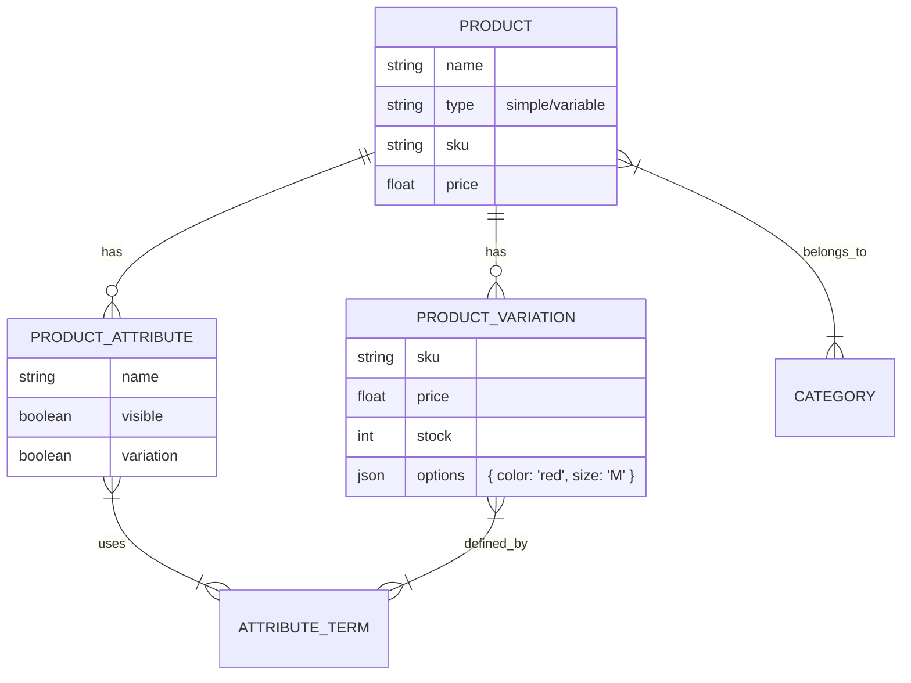

# KẾ HOẠCH TRIỂN KHAI UI/UX TOÀN DIỆN CHO CMS (Payload v3 Unified)
# COMPREHENSIVE CMS UI/UX IMPLEMENTATION PLAN

**Project**: Custom Admin UI - WordPress + WooCommerce Level CMS
**Created**: 2025-12-01
**Updated**: 2025-12-01 (Migrated to Payload v3 Unified Architecture)
**Status**: PLANNING
**Complexity**: ⚠️ VERY HIGH - Enterprise-level CMS

---

## 📋 TÓM TẮT ĐIỀU TRA (EXECUTIVE SUMMARY)

### Current State Analysis
✅ **Đã hoàn thành (Basic Level):**
- **Products**: CRUD cơ bản (6 tabs: General, Inventory, Attributes, Variations, Gallery, SEO).
- **Categories**: Danh sách phân cấp.
- **Attributes**: Global attributes & terms.
- **Variations**: Tạo biến thể cơ bản.

🔴 **Cần Nâng cấp & Bổ sung:**
- **Product Management**: UI chưa tối ưu cho việc quản lý nhiều biến thể (50+ variants), thiếu Bulk Edit, thiếu quản lý Attributes cục bộ.
- **Testing**: Chưa có quy trình test tự động.
- **Documentation**: Thiếu tài liệu hướng dẫn sử dụng và vận hành.

---

## 🏗️ KIẾN TRÚC HỆ THỐNG (SYSTEM ARCHITECTURE)

### 1. Unified App Architecture (Next.js 15 + Payload v3)
*(Như đã mô tả: Server Components + Local API + Server Actions)*

### 2. Product Data Architecture (E-commerce Core)
Mô hình dữ liệu cho Sản phẩm - Biến thể - Thuộc tính là trái tim của hệ thống E-commerce.



---

## 📅 PHASED IMPLEMENTATION ROADMAP

### 🟦 PHASE 1: FOUNDATION & UX POLISH (2 tuần)
**Goal**: Nâng cấp trải nghiệm người dùng và các tính năng nền tảng.

#### 1.1 Media Library (Priority 1)
- [ ] **Backend**: Collection `MediaFolders`, fields `alt`, `caption`.
- [ ] **Frontend**: Folder Tree UI, Drag & Drop Upload, Grid/List View.

#### 1.2 Dashboard Widgets
- [ ] **Frontend**: Stats Cards, Sales Chart, Recent Activity.

#### 1.3 Product & Category UX (Priority 1)
- [ ] **Gallery**: Drag & drop reordering (`@dnd-kit`).
- [ ] **Categories**: Drag & drop reordering, Tree view hiển thị cấp cha-con.
- [ ] **Inventory**: Cảnh báo sắp hết hàng (Low stock alerts).
- [ ] **SEO**: Google Preview & JSON-LD Preview.

---

### 🟩 PHASE 2: ADVANCED PRODUCT MANAGEMENT (3 tuần)
**Goal**: Hoàn thiện khả năng quản lý sản phẩm phức tạp (như WooCommerce).

#### 2.1 Enhanced Attributes Management
- [ ] **Global vs Local**: Hỗ trợ thêm thuộc tính cục bộ (chỉ dùng cho 1 sản phẩm) bên cạnh Global Attributes.
- [ ] **Term Management**: Tạo nhanh Term mới ngay trong màn hình sửa sản phẩm (Quick Add).
- [ ] **UX**: Cải thiện giao diện chọn Terms (Multi-select combobox tốt hơn).

#### 2.2 Advanced Variations (Biến thể)
- [ ] **Variation Generator**: UI tạo biến thể tự động từ các thuộc tính đã chọn (Matrix generation).
- [ ] **Bulk Edit Variations**: Chỉnh sửa hàng loạt giá, kho, hình ảnh cho nhiều biến thể cùng lúc.
- [ ] **Variation Swatches**: Cấu hình hiển thị (Màu sắc, Hình ảnh, Label) cho từng thuộc tính.

#### 2.3 Product Organization
- [ ] **Bulk Actions**: Xóa, Ẩn/Hiện, Thay đổi danh mục cho nhiều sản phẩm.
- [ ] **Duplication**: Sao chép sản phẩm (bao gồm cả attributes & variations).
- [ ] **Sorting**: Sắp xếp thứ tự sản phẩm thủ công.

---

### 🟨 PHASE 3: CORE CMS & E-COMMERCE (4 tuần)
**Goal**: Các tính năng quản trị và bán hàng.

#### 3.1 Users, Roles & Settings
- [ ] **RBAC**: Phân quyền chi tiết (Roles, Permissions).
- [ ] **Settings**: Cấu hình toàn trang (Site Identity, Email, SEO).

#### 3.2 Orders & Customers
- [ ] **Orders**: Quy trình xử lý đơn hàng, In hóa đơn.
- [ ] **Customers**: Hồ sơ khách hàng, lịch sử mua hàng.

---

### 🟧 PHASE 4: ANALYTICS & REPORTS (2 tuần)
**Goal**: Báo cáo kinh doanh.
- [ ] Sales Report, Product Performance, Export Data.

---

### 🟪 PHASE 5: TESTING & QA (2 tuần)
**Goal**: Đảm bảo chất lượng hệ thống trước khi Go-live.

#### 5.1 Unit Testing
- [ ] **Tools**: Vitest + React Testing Library.
- [ ] **Scope**: Test các utility functions (tính giá, format tiền tệ), Hooks, và UI Components nhỏ.

#### 5.2 Integration Testing
- [ ] **Tools**: Vitest.
- [ ] **Scope**: Test luồng dữ liệu Server Actions -> Database -> UI. Đảm bảo API Local hoạt động đúng.

#### 5.3 E2E Testing (End-to-End)
- [ ] **Tools**: Playwright.
- [ ] **Scope**: Test các luồng người dùng quan trọng:
    - Login -> Dashboard.
    - Tạo sản phẩm -> Thêm biến thể -> Lưu.
    - Upload ảnh -> Gán vào sản phẩm.
    - Tạo đơn hàng -> Đổi trạng thái.

#### 5.4 User Acceptance Testing (UAT)
- [ ] Triển khai lên môi trường Staging.
- [ ] Cho người dùng thật dùng thử và feedback.

---

### 🟥 PHASE 6: DOCUMENTATION & HANDOVER (1 tuần)
**Goal**: Chuyển giao hệ thống và tài liệu hướng dẫn.

#### 6.1 User Documentation (Dành cho Admin/Shop Manager)
- [ ] **Product Guide**: Hướng dẫn tạo sản phẩm, biến thể, quản lý kho.
- [ ] **Order Guide**: Quy trình xử lý đơn hàng.
- [ ] **Media Guide**: Cách quản lý thư viện ảnh.

#### 6.2 Developer Documentation (Dành cho Dev)
- [ ] **Architecture**: Sơ đồ hệ thống, luồng dữ liệu.
- [ ] **Setup Guide**: Hướng dẫn cài đặt môi trường, deploy.
- [ ] **API Reference**: Cách sử dụng Local API và Server Actions.
- [ ] **Component Library**: Danh sách các reusable components.

---

## 🏗️ TECHNICAL GUIDELINES

### 1. Code Organization
*(Giữ nguyên như cũ)*

### 2. Testing Strategy
- **Write tests alongside code**: Viết test ngay khi làm feature (TDD nếu có thể).
- **Mocking**: Mock Payload Local API khi chạy Unit Test để tốc độ nhanh.
- **CI/CD**: Tích hợp chạy test tự động khi Push code (GitHub Actions).

---

## 📦 DEPENDENCIES
*(Giữ nguyên như cũ, thêm testing tools)*
```json
{
  "vitest": "^1.x",
  "@testing-library/react": "^14.x",
  "playwright": "^1.x"
}
```